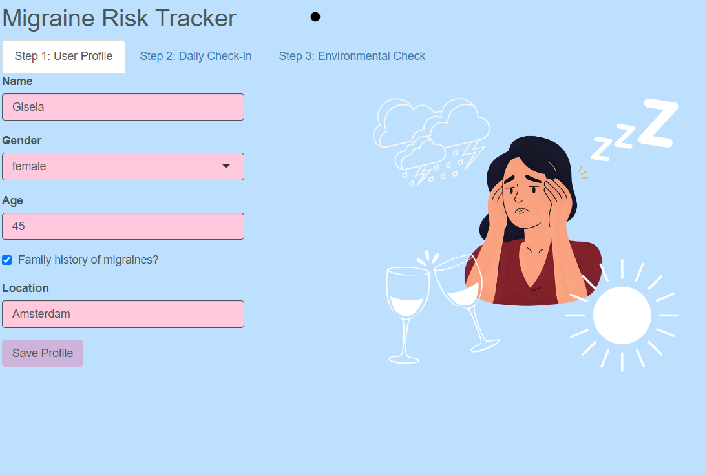
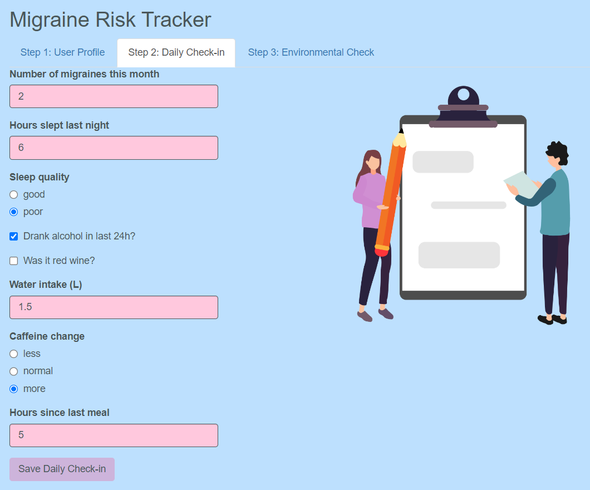

```{r setup, include=FALSE}
knitr::opts_chunk$set(
  collapse = TRUE,
  comment = "#>",
  fig.width = 6, fig.height = 4
)
library(migrane)
---

# Introduction

The **Migraine Risk Tracker** Shiny app helps you combine personal baseline factors, daily biological triggers, and environmental weather data into a single “migraine risk” score.

1.  How to install and load the package

2.  How to run app

3.  The three main steps of data collection

4.  Understanding the output

# **Installation**

Install the package from source


# from CRAN:
# install.packages("migrane")

# from local source
devtools::install(migrane)
```

Then load it:

```{r}
library(migrane)
```

## Launching the Shiny App

```{r}

shiny::runApp(system.file("app", package = "migrane_risk"))
```

# User Profile (Step 1)

In this panel the the package collects:

-   your name, gender, age
-   Your family migraine history
-   Your location (for later weather checks)

These inputs are arguments for `create_user_profile()`, which returns a baseline score:

```         
r
# Example:
profile <- create_user_profile(
  name = "Gisela",
  gender = "female",
  age  = 45,
  family_history = TRUE,
  location = "Amsterdam"
)
str(profile)
#> List of 2
#>  $ baseline_score: num 3
#>  $ location      : chr "Amsterdam"
```



# Biological Factors (Step 2)

Here you record daily habits:

-   Number of migraines this month

-   Sleep hours & quality

-   Alcohol & red-wine consumption

-   Hydration

-   Caffeine changes

-   Time since last meal

That inputs to `evaluate_biological_factors()`, producing a biological risk score:

```{r}

bio <- evaluate_biological_factors(
  migraines_month = 2,
  sleep_hours     = 6,
  sleep_quality   = "poor",
  alcohol         = TRUE,
  red_wine        = FALSE,
  water_liters    = 1.5,
  caffeine_change = "more",
  hours_since_last_meal = 5
)
str(bio)
#> List of 2
#>  $ biological_score    : num 5
#>  $ migraines_this_month: num 2

```



# Environmental Triggers (Step 3)

Click "Check Environmental Risk" to run `check_weather_risk()`. It fetches pressure, humidity, and temperature from OpenWeatherMap, scores them 0–3, and returns:

```{r}
# Make sure you set your own key beforehand:
Sys.setenv(OWM_API_KEY = "YOUR_API_KEY_HERE")

env <- check_weather_risk("Amsterdam")
str(env)
#> List of 2
#>  $ weather_score: num 1
#>  $ details      :List of 3
#>   ..$ pressure: num 1012
#>   ..$ humidity: num 87
#>   ..$ temp    : num 14.9

```

Because I don't want to pay for you, this app will need you to set your won API key, that can fetch the data from the weather map.

When you click "Check Environmental Risk" the app prints a combined summary:

```{r}
r
# Pseudocode of what you see:
Eyyy, Gisela! Here is your migraine risk summary for today:

Baseline score:           3  
Biological factors score: 5  
Environmental score:      1  
-------------------------------  
TOTAL migraine risk score:9  

Weather details:  
 • Pressure:    1012 hPa  
 • Humidity:     87 %  
 • Temperature: 14.9 °C  

Uh oh, Gisela! High migraine risk today! Chill out
```

#Add some explanations to the scores

# Session Info

```{sessioninfo::session_info()}

```
